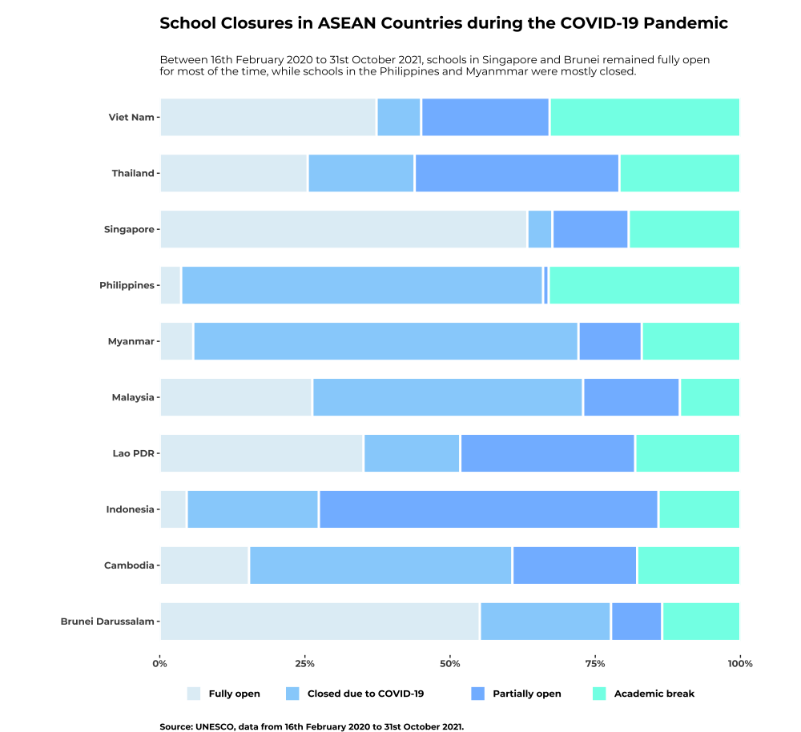

Compilation of charts produced for the #30DayChartChallenge on Twitter.

## Day 1: Part-to-Whole [link](https://github.com/elenayz/Data-Visualization/tree/main/30%20Day%20Chart%20Challenge/Day%201%20-%20Part%20to%20Whole)

## Day 2: Waffle [link](https://github.com/elenayz/Data-Visualization/tree/main/30%20Day%20Chart%20Challenge/Day%202%20-%20Waffle)

## Day 3: Flora and Fauna

## 

## Day 4: Historical [link](https://github.com/elenayz/Data-Visualization/tree/main/30%20Day%20Chart%20Challenge/Day%204%20-%20Historical)

## 

## Day 5: Slope [link](https://github.com/elenayz/Data-Visualization/tree/main/30%20Day%20Chart%20Challenge/Day%205%20-%20Slope)

## Day 6: Our World in Data [link](https://github.com/elenayz/Data-Visualization/tree/main/30%20Day%20Chart%20Challenge/Day%206%20-%20OWID)

## Day 7: Hazards [link](https://github.com/elenayz/Data-Visualization/tree/main/30%20Day%20Chart%20Challenge/Day%207%20-%20Hazards)

## Day 8: Humans [link](https://github.com/elenayz/Data-Visualization/tree/main/30%20Day%20Chart%20Challenge/Day%208%20-%20Humans)

## Day 9: High/low [link](https://github.com/elenayz/Data-Visualization/tree/main/30%20Day%20Chart%20Challenge/Day%209%20-%20High%3Alow)

## Day 10: Hybrid [link](https://github.com/elenayz/Data-Visualization/tree/main/30%20Day%20Chart%20Challenge/Day%2010%20-%20Hybrid)

## Day 11: Circular [link](https://github.com/elenayz/Data-Visualization/tree/main/30%20Day%20Chart%20Challenge/Day%2011%20-%20Circular)

## Day 12: BBC [link](https://github.com/elenayz/Data-Visualization/tree/main/30%20Day%20Chart%20Challenge/Day%2012%20-%20BBC)

## Day 13: Pop culture

## Day 14: New Tool

\*created with flourish

## Day 15: Positive/negative

\*created with streamgraph

## Day 16: Family

